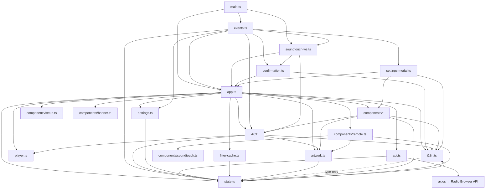

# Architecture

Codebase map for AfterTouch-RadioBrowser — structure, key files, module dependencies, entry
points, and conventions. Keep this document in sync with the code: regenerate it with the
`codebase-map` skill whenever the structure or module dependencies change.

## Summary

A lightweight single-page web app for searching, filtering, previewing, and playing internet
radio stations, built with vanilla TypeScript and Vite (no framework). Station data comes from
the Radio Browser API; a Bose SoundTouch host receives stations directly (reachability probe
+ station send). The FR-3 live remote — transport/volume commands and live state (now playing,
play status, volume, mute) over a WebSocket — is implemented in this release (see FEATURES.md
and the "SoundTouch remote control" convention below). FR-6 station artwork (favicon
thumbnails with skeleton loading, a per-station cache, and the Remote panel art slot) is
also implemented (see the "Station artwork (FR-6)" convention below). The UI is localized in
4 languages (`en`, `de`, `ru`, `ukr`).

## Structure Overview

```
AfterTouch-RadioBrowser/
├── src/                        # Application source
│   ├── main.ts                 # Entry point: render, wire events, fetch, ping SoundTouch
│   ├── app.ts                  # Global mutable state + render/refresh orchestration
│   ├── events.ts               # All user interaction via 3 delegated listeners
│   ├── actions.ts              # Domain actions: sanitize, favorites, language, SoundTouch send/preview + remote commands (REMOTE_KEYS, sendKeyPress, sendVolume, sendMute, scheduleVolumeSend)
│   ├── soundtouch-ws.ts        # WebSocket client: gabbo feed, XML parsing (full now-playing + device info), snapshot requests on connect + successful (re)connection checks, reconnect with backoff
│   ├── confirmation.ts         # FR-4 play-confirmation watcher: module-local pending record, single 15s timer, writes only deviceMessage
│   ├── api.ts                  # Radio Browser API client (axios): search/top/recent + languages/countries lists
│   ├── i18n.ts                 # Translations en/de/ru/ukr (as const) + locale helpers (getLocale, localizeFilterOptions, filterLabelOverrides)
│   ├── player.ts               # Persistent <audio> singleton
│   ├── settings.ts             # Settings defaults + localStorage persistence (enablePreview, hideRemoteSkipButtons)
│   ├── settings-modal.ts       # Settings popup mount/unmount + in-place state sync + no-blink re-label/live sync
│   ├── filter-cache.ts         # Filter option list localStorage cache (raw {value,label,code} lists)
│   ├── artwork.ts              # FR-6 station artwork: per-station favicon cache, background Image fetch, skeleton/empty slot rendering
│   ├── state.ts                # Shared types (Station, Settings, State, Mode, FilterOption, DeviceInfo, DeviceNowPlayingVerbose)
│   ├── styles.css              # All styling
│   └── components/             # Pure render functions returning HTML strings
│       ├── header.ts           # Logo branding, title, settings gear
│       ├── footer.ts           # Site footer with Radio Browser attribution
│       ├── filters.ts          # Search inputs, language/country dropdowns, limit select, mode chips
│       ├── station-card.ts     # Primary play-on-speaker + preview + favorite card actions
│       ├── player-bar.ts       # Now-playing info
│       ├── soundtouch.ts       # Settings-popup SoundTouch section (labeled host input + status + hints + device-info widget)
│       ├── remote.ts           # Live remote panel: now playing, transport (skip buttons toggleable), volume, mute, header ℹ device info + standby power button
│       ├── setup.ts            # Full-screen first-run setup view
│       ├── banner.ts           # Device-offline and service-unavailable banners
│       └── settings.ts         # Settings modal (SoundTouch config + language select + preview/hide-skip toggles + reset)
├── tests/
│   ├── app.test.ts             # Vitest suite (jsdom)
│   ├── pagination.test.ts      # List-pagination tests (jsdom)
│   ├── filters.test.ts         # Canonical language/country dropdown tests (jsdom)
│   ├── filter-cache.test.ts    # Filter option list cache tests (jsdom)
│   ├── artwork.test.ts         # FR-6 station artwork cache/rendering tests (jsdom)
│   ├── confirmation.test.ts    # FR-4 play-confirmation watcher tests (jsdom)
│   ├── soundtouch.test.ts      # SoundTouch reachability + device-info tests (jsdom)
│   ├── soundtouch-ws.test.ts   # SoundTouch live-remote WebSocket tests (jsdom)
│   ├── pwa-assets.test.ts      # FR-8 PWA manifest/icon/installability + polish tests (fs-based)
│   └── api.test.ts             # Radio Browser API wire-contract tests (axios mocked)
├── docs/                       # GitHub Pages hosting output (tracked, deploy-generated)
├── public/                     # Static assets copied as-is (logo.png: favicon + header brand; manifest.webmanifest + icon-192/512.png + apple-touch-icon.png: PWA installability)
├── index.html                  # Vite entry HTML (favicon/manifest/apple-touch-icon links + theme-color meta, all relative hrefs)
├── vite.config.ts              # Build + test config (jsdom, base '')
├── tsconfig.json               # Strict TS config
├── package.json                # Scripts: start/test/build/deploy
└── AGENTS.md, README.md, LICENSE
```

## Key Files

| File | Purpose |
|------|---------|
| `src/main.ts` | Application entry point (bootstrap) |
| `src/app.ts` | Global `state` export + `render()`/`refresh()` core; owns the sort→API `order`/`reverse` mapping (`SORT_API_PARAMS`) |
| `src/events.ts` | All event delegation (click/keydown/change on `#app`) |
| `src/state.ts` | Core domain types (FilterOption carries the canonical API `code` for label localization; DeviceNowPlayingVerbose / DeviceInfo are the FR-3 verbose state and full device-info payloads) |
| `src/api.ts` | Radio Browser API endpoints (search/top/recent + languages/countries lists; `searchStations` sends the mapped `order`/`reverse`) |
| `src/actions.ts` | Playback, favorites, SoundTouch domain logic + remote commands (`REMOTE_KEYS`, `sendKeyPress`, `sendVolume`, `sendMute`, `scheduleVolumeSend`, `soundtouchWsUrl`) |
| `src/soundtouch-ws.ts` | Live-state WebSocket client: gabbo feed, XML `<updates>` parsing (full now-playing payload + full device info), REST-proxy snapshot requests (`now_playing`/`volume`/`info`) on connect and on every successful (re)connection check, reconnect with backoff + `/info` probe |
| `src/confirmation.ts` | Passive FR-4 play-confirmation watcher: module-local pending record (station name, exact location, pre-send radio-playing flag), single 15 s timer, writes only `deviceMessage` (XSS-escapes interpolations); armed/cancelled by `events.ts`, evaluated by `soundtouch-ws.ts` |
| `src/i18n.ts` | 4-language translation dictionary + locale helpers (`getLocale`, `localizeFilterOptions`, `filterLabelOverrides`) |
| `src/settings.ts` | Settings defaults + persistence |
| `src/settings-modal.ts` | Settings popup mount/unmount + in-place state sync (syncSettingsModalState, relabelSettingsModal, live SoundTouch-section sync) |
| `src/filter-cache.ts` | Filter option list localStorage persistence (raw `{value, label, code}` lists with validation) |
| `src/artwork.ts` | FR-6 station artwork: per-station favicon cache (`radio-browser-art-<uuid>`, last-known-good JSON string), idempotent background `Image` fetch with a stale-guarded render hook, skeleton/empty slot rendering, and the playing-station art URL fallback chain |
| `vite.config.ts` | Build/test configuration |

## Module Dependencies



## Entry Points

- **Main**: `src/main.ts` — renders app, calls `refresh('top')`, pings saved SoundTouch host and
  opens the live-state WebSocket (`connectSoundtouchWs`)
- **Tests**: `tests/app.test.ts`, `tests/pagination.test.ts`, `tests/filters.test.ts`,
  `tests/filter-cache.test.ts`, `tests/artwork.test.ts`, `tests/confirmation.test.ts`,
  `tests/soundtouch.test.ts`, `tests/soundtouch-ws.test.ts`, `tests/pwa-assets.test.ts`,
  `tests/api.test.ts` — Vitest, jsdom environment
- **Deploy**: `npm run deploy` — build → `dist/` → `docs/` (GitHub Pages)

## Conventions

- **No framework** — vanilla TS + Vite; components are pure string-returning functions; no
  virtual DOM.
- **Event delegation**: all interaction handled by exactly 3 delegated listeners on `#app`
  (click, keydown, change) — plus a single document-level Escape listener for the settings popup
  (bound once, inert while closed); no per-element bindings.
- **Audio widget**: single persistent `<audio>` from `player.ts`; `render()` detaches it before
  `innerHTML` and re-inserts it into `.player` while preview is enabled (breaking this kills
  playback).
- **Setup view**: rendered (instead of the app shell) when no address is saved and setup was not
  skipped; it is the only user of the `#soundtouch`/`#saveSoundtouch` ids (the settings popup's
  host field uses `#settingSoundtouchHost`/`#settingSoundtouchSave`).
- **Host sanitization**: `sanitizeHost()` in `actions.ts` strips scheme, path/query and invalid
  characters; a non-hostname result is rejected (empty string).
- **Station card**: primary action is play-on-speaker (`data-play`, disabled with a hint when
  unconfigured/offline); there is no separate send button.
- **Pagination**: station lists are paged by `offset` (start index in `state.offset`, step
  `state.limit`); `refresh(mode)` always loads the first set (resets `offset` to 0) and every
  API call passes `offset` (`topvote`, `lastclick`, `search`), while favorites are sliced
  locally; `loadNextResultSet()`/`loadPreviousResultSet()` reload the current mode at the new
  offset (they never cycle modes) and no-op at the edges; the prev/next buttons stay visible
  and render `disabled` at the edges (first set / short final set).
- **Sorting**: search results and the favorites list are sortable via the "Sort by" select in
  the filters panel. `state.sort` (`name_asc`/`name_desc`/`clickcount`/`clicktrend`/`votes`,
  default `votes`) selects the order; `SORT_API_PARAMS` in `app.ts` maps it to the API's
  `order`/`reverse` (`name` with no `reverse` for A–Z / `reverse=true` for Z–A;
  `clickcount`/`clicktrend`/`votes` with `reverse=true`), passed to `searchStations`, while
  favorites sort client-side via `compareFavorites` in `actions.ts` by the same key (names via
  `localeCompare` in the active UI language's locale, missing names as `''`; numeric fields
  descending with missing values as `0` — `clicktrend` is optional on `Station`, older saved
  favorites may lack it). The select always shows the current order; in Search and Favorites
  modes the results toolbar appends the sort label to the status line. Changing the sort
  re-runs the search (offset 0) in Search mode, re-sorts favorites in place (no API call) in
  Favorites mode, and starts a search from Top/Recent like the other filter changes. Reset
  restores the default; the choice is session-only (not persisted).
- **Localized filter dropdowns**: Language/Country filters are `<select>`s fed once at startup
  by `/languages` (entries without a valid `iso_639` are dropped) and `/countries`; each option
  carries a `value` (canonical name / ISO code), a fetch-time English `label`, and the canonical
  API `code` (`iso_639` / `iso_3166_1`). At render time `renderFilters` passes the option lists
  through `localizeFilterOptions` (in `i18n.ts`): labels are resolved for the active UI language
  via per-language `filterLabelOverrides` → `Intl.DisplayNames` in the mapped locale
  (`getLocale` maps `ukr` → `uk`; `fallback: 'none'` so unmappable codes keep their existing
  label) → the option's existing label, then sorted by the localized label with the locale's
  collation; the input array is never mutated and API values stay canonical. Selecting an option
  searches immediately; language is sent with `languageExact=true`, country as `countrycode`
  (never `country`); option labels/values are HTML-escaped. Each list's last successful
  non-empty fetch is cached raw under its own localStorage key
  (`radio-browser-languages-cache` / `radio-browser-countries-cache`, storing the fetch-time
  `{value, label, code}` entries so any UI language re-localizes them); on a failed or empty
  fetch the dropdowns fall back to that cached list, and with no valid cache they render with
  only the 'All' option. Caching is best-effort: malformed entries or a full localStorage are
  ignored, never fatal.
- **Language codes**: `en`/`de`/`ru`/`ukr` (not `uk`); `getLabels()` maps `'uk'` → `'ukr'`;
  `detectLanguage()` maps `'uk'` → `'ukr'` and unsupported locales → `en`. The settings
  popup's Language select shows the four languages as fully written native names (English,
  Deutsch, Русский, Українська) for those codes.
- **localStorage keys**: `radio-browser-language`, `radio-browser-soundtouch-host`,
  `radio-browser-favorites`, `radio-browser-settings`,
  `radio-browser-languages-cache` / `radio-browser-countries-cache` (raw JSON fallback lists of
  the last successful Language/Country dropdown options), and
  `radio-browser-art-<stationuuid>` (JSON-string station artwork URL — see the Station
  artwork convention).
- **Settings**: `enablePreview` (default off) + `hideRemoteSkipButtons` (default on — hides the
  Remote panel's next/prev buttons); legacy settings keys are ignored on load. The language
  control and the SoundTouch host config live in the settings popup: the language persists
  under `radio-browser-language` and the host under `radio-browser-soundtouch-host` (neither is
  part of the settings JSON); reset never touches either. The host field is labeled
  `soundtouchNetworkAddress` ("SoundTouch network address") above the input — the same title
  placement as the Language select — and the Remote panel header carries the ℹ device-info
  widget next to its connection status. In the popup the ℹ's rows open upward, anchored past the
  config row (`right: -110px`), clear of the host input; the modal panel keeps its native
  scrolling, and expanding the ℹ scrolls the rows into view when the visible area is too small.
  Saving a host from the popup keeps
  the popup open — the shell behind updates surgically (Remote panel, cards, banner) and the
  popup's live SoundTouch section syncs in place while `render()` re-inserts the preserved
  popup node (no-blink, `modal-overlay--no-anim`).
- **Station artwork (FR-6)**: `src/artwork.ts` owns all artwork loading/rendering. Station
  cards render the `favicon` URL (new optional `Station.favicon` field, from the Radio
  Browser API) as a fixed-size `.artwork-slot` in a new `.station-head` area; the Remote
  panel's now-playing view renders the device-reported logo first — `ContentItem.containerArt`
  (the artwork the speaker echoes in the WS payload) → `detail.art` →
  `playingStationArtUrl(state)` (current station `favicon` → cached URL by `stationuuid` →
  `''`) — the WS truth pairs with the WS-derived title; the slot uuid follows the echoed
  station when the device reports a canonical `/stations/byuuid/<uuid>` location, else the
  highlighted station's. In the Remote panel the slot is **plays-only gated** (wave 11):
  it renders only while `state.devicePlayStatus` is `PLAY_STATE` or `BUFFERING_STATE` —
  paused, stopped, and empty/unknown statuses (never connected, host change, explicit close)
  render nothing for the logo while the title/meta/status chip keep the last-known payload
  (the gate reads only WebSocket-derived state; station-card thumbnails and the preview
  player bar are unaffected). Every slot is `renderArtworkSlot(url, uuid?)`:
  `''` for an empty URL, a `.artwork-skeleton` span carrying `data-art-url`/`data-art-uuid`
  (CSS shimmer, disabled under `prefers-reduced-motion`) while loading, an
  `` (escaped, no inline JS, never
  after a failure) once ready, and a `.artwork-slot--empty` span on error. `render()` calls
  `scanArtwork()` last: it walks unrequested `[data-art-url]` slots and `requestArtwork`s
  them — idempotent (one `Image` per URL, resolved at request time via the plain global, not
  at module load), and each settle flips the registry (`getArtworkLoadState`), writes the
  cache on success via the live slot's `data-art-uuid`, and calls the render hook only while
  a slot for that URL is still in the DOM (stale-guard — settled URLs are never re-requested,
  so the hook's `render()` re-scan cannot loop). `setRenderHook(render)` is wired once at
  `app.ts` module load. The cache mirrors FR-1 filter-cache semantics: the URL is stored per
  station as a JSON string under `radio-browser-art-<uuid>` (last-known-good, best-effort;
  `saveArtworkCache` is a silent no-op for an empty URL or uuid and otherwise overwrites
  with the latest URL; a malformed/unavailable cache reads as `null`).
  `rememberStationArtwork(uuid, url)` persists the URL and starts background verification
  (registry-only for an empty uuid; write-once — a saved URL is never clobbered), and never
  resurrects a settled error — an
  in-flight or dead entry is left untouched. `resetArtworkState()` is a test seam
  clearing registry, in-flight requests, and the hook.
- **SoundTouch ports**: 8090 = the device Web API for reachability (GET `/info` as a `no-cors`
  probe, 5s timeout), station send (POST `/select`, `text/plain;charset=UTF-8`, body
  `<ContentItem source="RADIO_BROWSER" ...>` carrying `<itemName>` and `<containerArt>`
  children when known — the FR-6 artwork send-with-play form pinned in API-NOTES.md), and the
  remote-control commands (POST `/key` press+release pairs with `sender="Gabbo"`,
  POST `/volume`). 8080 = the live-state WebSocket feed (`ws://<host>:8080/`, "gabbo"
  protocol, XML `<updates>` messages) that also answers GET requests with a REST-proxy
  `<msg>` envelope. An explicit port in the saved host is honored for both
  (no `:8090`/`:8080` appended). The probe's opaque response only proves the port answers;
  device metadata (name/type) is not readable over HTTP (CORS), but the WebSocket REST-proxy
  exposes it — the app fetches `now_playing`/`volume`/`info` on every connection open
  and on every successful (re)connection check.
- **SoundTouch remote control**: with an address saved, the app keeps one WebSocket
  (`src/soundtouch-ws.ts`) to `ws://<host>:8080/` ("gabbo" protocol) and mirrors device state
  from XML `<updates>` messages (`nowPlayingUpdated` → now playing + play status,
  `volumeUpdated` → volume + mute; unknown or signal-only events keep the last-known state).
  On every connection open — and again on every successful (re)connection check (startup
  for a saved address, address save, successful drop-recovery probe) — the client sends
  `now_playing`/`volume`/`info` snapshot requests over the same WS (REST-proxy `<msg>`
  envelope, `requestID` increments per request and resets per connection); a check-time
  request is only sent while the current socket for the current host is open; RESPONSE
  bodies are parsed with the same defensive path as `<updates>` and ignored when they
  arrive from a superseded connection.
  Commands are `no-cors` POSTs on 8090: `/key` press+release pairs (`sender="Gabbo"`) for
  play/pause/next/prev and `/volume` for volume/mute (volume slider sends one debounced POST
  per drag via `scheduleVolumeSend`). **No echo loops**: live device state is written only
  from WebSocket events, never from command POSTs or optimistic updates. On WS loss the app
  keeps the last-known state, marks the connection `reconnecting`, and retries with capped
  exponential backoff (1s→2s→4s→8s→16s→30s) while probing reachability via `/info`; only
  repeated probe failures show the offline banner (FR-11) and disable the controls. The
  remote panel (`src/components/remote.ts`) renders now playing, transport, volume, and mute,
  and the SoundTouch widget shows the WebSocket-fed device info; the remote panel header also
  carries the ℹ device-info widget next to its connection status (expanding the same curated
  rows as a floating popover — upward in the settings popup, downward over the panel content in
  the remote header — never in-flow, so expanding never shifts layout), followed by the
  **standby power button** (wave 10): a fixed-size icon button in the header's upper-right
  corner sending a `POWER` press+release `/key` pair, enabled only while the WebSocket is
  connected (`wsStatus === 'connected'`), static icon (the feed documents no power-state
  signal), unaffected by `hideRemoteSkipButtons`, and labeled `remoteStandby` in all four
  languages. The now-playing parser
  stores the full verbose payload (`deviceNowPlayingDetail` in `state.ts`: stationName, art,
  ContentItem, skip/favorite presence flags, seekSupported, shuffle/repeat, streamType,
  trackID, position, description, stationLocation) — the panel derives the title
  `track` → `stationName` → `ContentItem.itemName` → "No station playing", the artist falls
  back to the verbose `description`, next/prev are gated on the `skipEnabled` /
  `skipPreviousEnabled` presence flags (in the component and in the delegated click
  handler), and artwork renders through the FR-6 artwork slot gated by the wave-11
  plays-only rule — the slot renders only while `devicePlayStatus` is `PLAY_STATE` or
  `BUFFERING_STATE` (playing, or starting to play); paused/stopped/unknown keeps the
  last-known payload but drops the logo entirely (see the Station artwork convention
  below). The `info` snapshot response populates the
  device payload (id, name, type, moduleType, variant, variantMode, country/region
  codes, networkInfo type + IP, first component's category/firmware, marge URL/UUID;
  the element's own `deviceID` attribute wins over the RESPONSE header). The
  `networkInfo` `macAddress` and the component `serialNumber` are **not parsed** —
  they uniquely identify the physical unit and are excluded for privacy. The widget
  renders the curated rows — id, name, type, module type, variant, IP, firmware —
  each row only when its data exists (labels `deviceName`/`deviceType`/`deviceId`/
  `deviceModuleType`/`deviceVariant`/`deviceIp`/`deviceFirmware` exist in
  all four languages). The `info` snapshot is re-requested on
  each successful (re)connection check.
- **Play-on-speaker confirmation (FR-4)**: tapping play on a station arms a module-local
  pending send in `src/confirmation.ts` — the `sendingToSpeaker` message with the
  station/device interpolations (XSS-escaped at the write site) plus one 15 s timer —
  before the `/select` POST. A tap for a station the device already plays (`PLAY_STATE`
  with a matching `ContentItem.location`) short-circuits: no POST, no message, no pending.
  `evaluateNowPlaying()` runs after every applied now-playing payload (pushed `<updates>`
  and snapshot RESPONSEs) and resolves the pending send in M4 → M3 → M1 → M5 order:
  `INVALID_SOURCE` → invalid-source hint; matching `STOP_STATE` → stream-failed hint;
  matching location or a `RADIO_BROWSER` `PLAY_STATE` (when radio wasn't already playing
  at send time) → silent confirm (message cleared, timer dropped); `BUFFERING_STATE` and
  everything else keep waiting. The timer firing shows the timeout hint. Remote commands,
  the volume slider, address save/clear, and the unreachable probe paths cancel the pending
  send. **No echo loops**: the watcher only reads state and writes `deviceMessage` — it
  never fetches, POSTs, or requests snapshots.
- **Hosting**: `docs/` is committed deploy output for GitHub Pages; `dist/` and `.DS_Store`
  are gitignored. `public/` is copied to the dist/docs root by Vite; the favicon uses a
  relative `href="logo.png"` so it resolves under the GitHub Pages subpath. The manifest
  (`manifest.webmanifest`) and all icon URLs are relative for the same subpath;
  `theme_color`/`background_color` = `#f7f6f2` (`--bg`) are duplicated in the manifest, the
  index.html `theme-color` meta, and CSS — update all three together on theme change. No
  service worker by design. PWA icons are derived from `logo.png`: `icon-192.png`/`icon-512.png`
  are padded with the background color (safe for maskable), `apple-touch-icon.png` is a plain
  180x180 opaque downscale (iOS applies its own rounding).
