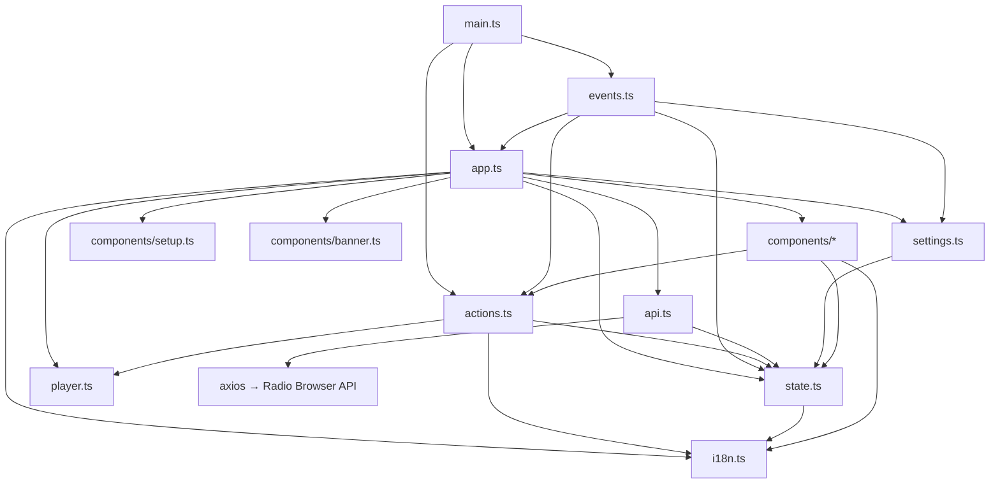

# Architecture

Codebase map for AfterTouch-RadioBrowser — structure, key files, module dependencies, entry
points, and conventions. Keep this document in sync with the code: regenerate it with the
`codebase-map` skill whenever the structure or module dependencies change.

## Summary

A lightweight single-page web app for searching, filtering, previewing, and playing internet
radio stations, built with vanilla TypeScript and Vite (no framework). Station data comes from
the Radio Browser API; a Bose SoundTouch host can receive stations directly. The UI is
localized in 4 languages (`en`, `de`, `ru`, `ukr`).

## Structure Overview

```
AfterTouch-RadioBrowser/
├── src/                        # Application source
│   ├── main.ts                 # Entry point: render, wire events, fetch, ping SoundTouch
│   ├── app.ts                  # Global mutable state + render/refresh orchestration
│   ├── events.ts               # All user interaction via 3 delegated listeners
│   ├── actions.ts              # Domain actions: sanitize, favorites, language, SoundTouch send/preview
│   ├── api.ts                  # Radio Browser API client (axios)
│   ├── i18n.ts                 # Translations: en/de/ru/ukr (as const)
│   ├── player.ts               # Persistent <audio> singleton
│   ├── settings.ts             # Settings defaults + localStorage persistence
│   ├── state.ts                # Shared types (Station, Settings, State, Mode)
│   ├── styles.css              # All styling
│   └── components/             # Pure render functions returning HTML strings
│       ├── header.ts           # Logo branding, title, language chips, settings gear
│       ├── footer.ts           # Site footer with Radio Browser attribution
│       ├── filters.ts          # Search inputs, limit select, mode chips
│       ├── station-card.ts     # Primary play-on-speaker + preview + favorite card actions
│       ├── player-bar.ts       # Now-playing info
│       ├── soundtouch.ts       # Host input + reachability status + hints
│       ├── setup.ts            # Full-screen first-run setup view
│       ├── banner.ts           # Device-offline banner
│       └── settings.ts         # Settings modal (enablePreview toggle + reset)
├── tests/
│   └── app.test.ts             # Vitest suite (jsdom)
├── docs/                       # GitHub Pages hosting output (tracked, deploy-generated)
├── public/                     # Static assets copied as-is (logo.png: favicon + header brand)
├── index.html                  # Vite entry HTML (favicon link, relative href)
├── vite.config.ts              # Build + test config (jsdom, base '')
├── tsconfig.json               # Strict TS config
├── package.json                # Scripts: start/test/build/deploy
└── AGENTS.md, README.md, LICENSE
```

## Key Files

| File | Purpose |
|------|---------|
| `src/main.ts` | Application entry point (bootstrap) |
| `src/app.ts` | Global `state` export + `render()`/`refresh()` core |
| `src/events.ts` | All event delegation (click/keydown/change on `#app`) |
| `src/state.ts` | Core domain types |
| `src/api.ts` | Radio Browser API endpoints |
| `src/actions.ts` | Playback, favorites, SoundTouch domain logic |
| `src/i18n.ts` | 4-language translation dictionary |
| `src/settings.ts` | Settings defaults + persistence |
| `vite.config.ts` | Build/test configuration |

## Module Dependencies



## Entry Points

- **Main**: `src/main.ts` — renders app, calls `refresh('top')`, pings saved SoundTouch host
- **Tests**: `tests/app.test.ts` — Vitest, jsdom environment
- **Deploy**: `npm run deploy` — build → `dist/` → `docs/` (GitHub Pages)

## Conventions

- **No framework** — vanilla TS + Vite; components are pure string-returning functions; no
  virtual DOM.
- **Event delegation**: all interaction handled by exactly 3 listeners on `#app` (click,
  keydown, change) — no per-element bindings.
- **Audio widget**: single persistent `<audio>` from `player.ts`; `render()` detaches it before
  `innerHTML` and re-inserts it into `.player` while preview is enabled (breaking this kills
  playback).
- **Setup view**: rendered (instead of the app shell) when no address is saved and setup was not
  skipped; the same `#soundtouch`/`#saveSoundtouch` ids are reused by the compact bar.
- **Host sanitization**: `sanitizeHost()` in `actions.ts` strips scheme, path/query and invalid
  characters; a non-hostname result is rejected (empty string).
- **Station card**: primary action is play-on-speaker (`data-play`, disabled with a hint when
  unconfigured/offline); there is no separate send button.
- **Pagination**: station lists are paged by `offset` (start index in `state.offset`, step
  `state.limit`); `refresh(mode)` always loads the first set (resets `offset` to 0) and every
  API call passes `offset` (`topvote`, `lastclick`, `search`), while favorites are sliced
  locally; `loadNextResultSet()`/`loadPreviousResultSet()` reload the current mode at the new
  offset (they never cycle modes) and no-op at the edges; the prev/next buttons stay visible
  and render `disabled` at the edges (first set / short final set).
- **Language codes**: `en`/`de`/`ru`/`ukr` (not `uk`); `getLabels()` maps `'uk'` → `'ukr'`;
  `detectLanguage()` maps `'uk'` → `'ukr'` and unsupported locales → `en`.
- **localStorage keys**: `radio-browser-language`, `radio-browser-soundtouch-host`,
  `radio-browser-favorites`, `radio-browser-settings`.
- **Settings**: single `enablePreview` toggle (default off); legacy settings keys are ignored on
  load.
- **SoundTouch ports**: 8000 = reachability (HEAD, `no-cors`); 8090 = station send (POST,
  `text/plain;charset=UTF-8`).
- **Hosting**: `docs/` is committed deploy output for GitHub Pages; `dist/` and `.DS_Store`
  are gitignored. `public/` is copied to the dist/docs root by Vite; the favicon uses a
  relative `href="logo.png"` so it resolves under the GitHub Pages subpath.
